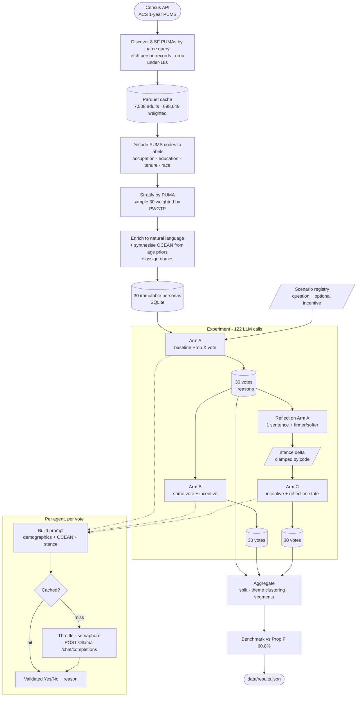

# San Francisco Population Simulation

Simulates 30 real-demographic San Francisco residents voting on a ballot measure,
then benchmarks the result against how that measure actually went.

**Pipeline:** Census microdata → 30 synthetic residents (demographics + OCEAN) →
ballot scenario → aggregate → benchmark vs reality → reflect → re-run under
incentive and measure the behavioural delta.

Based on Park et al. 2023, *Generative Agents: Interactive Simulacra of Human
Behavior*. The **reflection** mechanism (§4.2) is adapted; the memory stream and
its retrieval machinery deliberately are not — see *Divergences*.

**Ground truth:** SF Proposition F (2021) capped third-party delivery fees at 15%
and passed with **60.8% Yes**.

---

## Setup

**1. Ollama**

```bash
brew install ollama                  # macOS; or ollama.com
ollama serve                         # leave running in its own terminal
ollama pull llama3.1:8b              # quantised Q4_K_M by default, ~4.7GB
ollama list                          # LLM_MODEL must match this tag exactly
```

**2. Environment**

```bash
uv sync
cp .env.example .env
```

```dotenv
LLM_MODE=openai_compat
LLM_MODEL=llama3.1:8b
LLM_BASE_URL=http://localhost:11434/v1
LLM_API_KEY=ollama
LLM_MAX_CONCURRENCY=2
```

**3. Personas** — pulls Census data, caches it, builds and stores 30 residents.

```bash
uv run python -m scripts.generate_personas
```

**4. Simulation** — runs all three arms, writes `data/results.json`.

```bash
AGENT_LIMIT=3 uv run python -m scripts.run_simulation   # smoke test, ~15 calls
uv run python -m scripts.run_simulation                 # full run, 122 calls
uv run python -m scripts.make_agent_table               # markdown tables for this README
uv run pytest                                           # unit tests, no network
```

---

## Data sources and key choices

### Where the personas come from

| Source | Detail |
|---|---|
| **Dataset** | US Census ACS 1-year **PUMS** (Public Use Microdata Sample) |
| **Geography** | 8 San Francisco PUMAs, discovered by API query — not hardcoded |
| **Records pulled** | 7,508 adults (18+), representing **698,649 weighted people** |
| **Variables** | `AGEP` `PINCP` `HINCP` `OCCP` `SCHL` `TEN` `RAC1P` `HISP` `PWGTP` |
| **Sampled** | 30 residents, stratified by PUMA, weighted by `PWGTP` |

**Why PUMS and not ACS summary tables.** Aggregate tables give one distribution
per variable. Sampling each independently manufactures incoherent people —
82-year-old software engineers earning $12k — because marginals don't encode that
age correlates with income correlates with occupation. PUMS rows are individual
anonymised respondents, so every attribute in a sampled row belongs together. The
joint distribution comes free.

**Why weighted.** Each record carries `PWGTP` — the number of real people it
stands for. The Census over-samples some groups, so raw record counts aren't
proportional to real people. Sampling weighted by `PWGTP` makes 30 agents look
like the actual city rather than like the survey.

**Why stratified.** Pure random sampling at n=30 would leave some of the 8 areas
empty by chance. Proportional allocation by summed weight (largest-remainder
method, floor of 1 per area) guarantees coverage, at a small cost in statistical
purity.

**Geography is derived, not assumed.** PUMA codes come from a name query filtered
on county, anchored at string start. A substring match initially swept in a San
Mateo PUMA covering *South San Francisco*; it surfaced because weighted population
came to 795k against SF's true ~690k. PUMS resolves to PUMAs (~100k people each),
not SF's 41 named neighbourhoods — labels are parsed from official PUMA names and
the resolution limit is stated, not faked.

**OCEAN is synthesised, not measured.** Big Five traits aren't in Census data.
They're drawn from a normal distribution nudged by age using small coefficients
from the aging literature (largest effect 0.08 vs SD 0.18 — individual variation
dominates the demographic prior roughly 2:1). This is the largest source of
*modelled* rather than *measured* variance in the project.

**Names are not conditioned on ethnicity.** Ethnicity is stated explicitly in the
persona instead, so there's one auditable signal rather than two overlapping ones.
Hispanic origin (`HISP`) is merged with race (`RAC1P`), since race alone would
misrepresent a large share of the city.

### Why local inference (Ollama)

The provider changed twice. The reason is a constraint on this class of
experiment, not an accident:

1. **Gemini** (`gemini-3.6-flash`) — free tier allows 5 requests/minute. A 3-agent
   smoke test needs 14 calls, so even the smallest test rate-limited before
   finishing.
2. **Groq** — 30 requests/minute, fine for one pass, but prompt iteration needs
   many passes and a daily token ceiling made that impractical.
3. **Ollama, local** — no rate limit, no quota, no key. Runs on the Mac's GPU via
   Metal; a quantised 8B model handles a 122-call run and is free to re-run as
   often as tuning requires.

The switch cost **one environment variable**. The client targets the
OpenAI-compatible chat API, which Ollama also serves, so no application code
changed. Trade-off: a quantised 8B model holds a persona less consistently than a
frontier model, and that limitation carries into the results.

---

## High-level design



Two modules touch the outside world — `census/client.py` and `llm/client.py` —
and nothing downstream of them knows an external API exists. Personas are written
once and never mutated; the stance produced by reflection is separate state, so
Arm B and Arm C both start from an identical population and the comparison stays
clean.


**No agent framework.** These agents are persistent identity plus a stateless
reasoning function — no tool selection, no cyclic control flow, no multi-agent
message passing. LangGraph would be abstraction cost with no return. It would earn
its place if social influence were added (multi-round neighbour observation with
convergence); the runtime sits behind a clean interface so that swap stays local.

---

## One vote, end to end

```
orchestrator.run_scenario(personas, scenario)
  └─ asyncio.gather over 30 agents
       └─ _with_retry(factory)                   <- rebuilds coroutine per attempt
            └─ runtime.decide(persona, scenario, stance)
                 ├─ prompts.build_vote_prompt()  <- demographics + OCEAN + stance
                 ├─ client.complete_json()
                 │    ├─ cache lookup (sha256 of model + temperature + prompts)
                 │    ├─ semaphore (max_concurrency)
                 │    ├─ throttle (min interval between request starts)
                 │    └─ POST /v1/chat/completions
                 └─ _normalise_vote() -> Pydantic Vote  <- "maybe" raises, never returns
```

What this buys: the runtime is **stateless** so it parallelises and tests against a
fake client with no network; every call is **cached** so re-runs are free and
deterministic; a hedged or malformed response **fails at the boundary** instead of
polluting the aggregate.

---

## Evaluation design

Three arms sharing one baseline, so the incentive effect and the reflection effect
can be separated rather than confounded:

| Arm | Sequence | Isolates |
|---|---|---|
| **A** | Prop X vote | Baseline — the Part 2 / Part 3 number |
| **B** | Prop X vote + incentive to vote No | The incentive effect |
| **C** | Arm A → reflect → incentive | Reflection's added contribution (C − B) |

The question text is byte-identical across arms; only the `incentive` line differs.
122 LLM calls per full run (90 votes + 30 reflections + 2 theme clusterings).

---

## Scenario results

**Proposition X:** cap food delivery app fees (DoorDash, Uber Eats) at 15%.

| Arm | Yes | No | Yes % | vs Arm A |
|---|---|---|---|---|
| **A — baseline** | 23 | 7 | **76.7%** | — |
| **B — incentive** | 28 | 2 | 93.3% | +16.6 pts |
| **C — reflect + incentive** | 23 | 7 | 76.7% | +0.0 pts |

### Top 3 reasons

| Yes | n | No | n |
|---|---|---|---|
| Helping small businesses | 9 | Concerns about job prospects and the local economy | 3 |
| High fees as a barrier | 6 | Opposition to government regulation of private companies | 1 |
| Affordability and cost of living | 4 | Self-interest as a high-income manager | 1 |

### Most interesting agent

**Tariq Ferreira**, 38, registered nurse, Western Addition & Marina, household
income **$340,000** — voted **Yes**:

> "I'm concerned about the impact of high fees on my friends who run small
> restaurants and cafes in the neighbourhood where I live and socialise."

*Why:* it's the clearest vote against economic self-interest in the set — someone
whose income makes delivery fees irrelevant voting on behalf of businesses rather
than his own budget, on social rather than financial grounds. Selection is
automated: the agent whose vote least matches the expectation implied by household
income.

### What the aggregate hides

Arms A and C both read 23/7, but they are **not the same 23 people**. Victor Silva
flipped No→Yes and Miguel Ramirez flipped Yes→No, cancelling out. Reading only the
headline split would miss both.

Arm B is more striking: **six of the seven Arm A "No" voters switched to Yes when
offered payment to vote No.** Exactly one agent accepted — Daniel Shah, a
physician with a $400k household income.

---

## Full agent list and voting results

| # | Name | Age | Neighbourhood | Occupation | HH income | A | B | C | Stance |
|---|---|---|---|---|---|---|---|---|---|
| 1 | Tariq Ferreira | 38 | Western Addition & Marina | Registered Nurses | $340,000 | Yes | Yes | Yes | +0.25 |
| 2 | Farid Alvarez | 52 | Central & Bernal Heights | Pharmacy Technicians | $230,000 | Yes | Yes | Yes | +0.25 |
| 3 | Hana Patel | 22 | Ingleside & South Central | Security Guards | $142,120 | No | Yes | No | −0.25 |
| 4 | Ibrahim Gupta | 45 | Central & Bernal Heights | Chief Executives | $563,000 | No | No | No | −0.25 |
| 5 | Amara Whitfield | 76 | Chinatown, North Beach & Russian Hill | retired | $0 | Yes | Yes | Yes | +0.25 |
| 6 | Jonas Delgado | 43 | Chinatown, North Beach & Russian Hill | Project Management Specialists | $180,000 | Yes | Yes | Yes | −0.10 |
| 7 | Rosa Park | 29 | Western Addition & Marina | Financial Analysts | $164,500 | Yes | Yes | Yes | +0.25 |
| 8 | Victor Silva | 74 | Ingleside & South Central | retired | $280,810 | No | Yes | **Yes** | −0.25 |
| 9 | Miguel Ramirez | 31 | South of Market & Mission | Other Managers | $363,000 | Yes | Yes | **No** | −0.10 |
| 10 | Grace Ortega | 73 | Bayview & Hunters Point | retired | $29,500 | Yes | Yes | Yes | +0.00 |
| 11 | Nikhil Zhang | 28 | Richmond, Western Addition & Presidio | Other Managers | $105,000 | Yes | Yes | Yes | +0.25 |
| 12 | Caleb Jackson | 53 | Central & Bernal Heights | Elementary/Middle School Teachers | $144,200 | Yes | Yes | Yes | +0.25 |
| 13 | Kenji Nguyen | 58 | Richmond, Western Addition & Presidio | Bookkeeping & Accounting Clerks | $55,000 | Yes | Yes | Yes | +0.25 |
| 14 | Naomi Bennett | 25 | South of Market & Mission | Computer Hardware Engineers | $484,000 | Yes | Yes | Yes | +0.25 |
| 15 | Olivia Kaur | 44 | South of Market & Mission | Financial Analysts | $50,000 | No | Yes | No | −0.25 |
| 16 | Simone Chen | 43 | Ingleside & South Central | Educational Instruction & Library Workers | $102,200 | Yes | Yes | Yes | +0.25 |
| 17 | Rafael Reyes | 63 | Bayview & Hunters Point | Secretaries & Administrative Assistants | $75,000 | Yes | Yes | Yes | −0.10 |
| 18 | Jamal Castillo | 18 | Bayview & Hunters Point | Recreation Workers | $147,000 | No | Yes | No | −0.25 |
| 19 | Theresa Santos | 23 | Ingleside & South Central | Waiters and Waitresses | $5,000 | Yes | Yes | Yes | +0.25 |
| 20 | Camila Duarte | 57 | Richmond, Western Addition & Presidio | Industrial Engineers | $120,000 | No | Yes | No | −0.25 |
| 21 | Yusuf Gallagher | 82 | Outer Sunset & Inner Sunset | retired | $24,200 | Yes | Yes | Yes | +0.25 |
| 22 | Wei Kim | 47 | Western Addition & Marina | Marketing Managers | $88,000 | Yes | Yes | Yes | +0.25 |
| 23 | Omar Hoffman | 42 | Central & Bernal Heights | Lawyers and Judges | $388,100 | Yes | Yes | Yes | +0.25 |
| 24 | Priya Ibrahim | 26 | Western Addition & Marina | Software Developers | $620,550 | Yes | Yes | Yes | +0.25 |
| 25 | Elena Vargas | 70 | Outer Sunset & Inner Sunset | retired | $140,900 | Yes | Yes | Yes | +0.25 |
| 26 | Samuel Lam | 56 | Chinatown, North Beach & Russian Hill | Packers and Packagers, Hand | $114,000 | Yes | Yes | Yes | +0.25 |
| 27 | Maya Walsh | 31 | South of Market & Mission | Graphic Designers | $236,500 | Yes | Yes | Yes | +0.25 |
| 28 | Daniel Shah | 62 | Central & Bernal Heights | Physicians | $400,000 | Yes | **No** | Yes | −0.10 |
| 29 | Andre Mendoza | 55 | Outer Sunset & Inner Sunset | Packers and Packagers, Hand | $800 | Yes | Yes | Yes | +0.25 |
| 30 | Lucas Tanaka | 51 | Chinatown, North Beach & Russian Hill | Computer & Information Systems Managers | $703,000 | No | Yes | No | −0.25 |

*7 agents changed vote under the incentive alone; 2 changed after reflecting first.
Bold marks a vote that differs from Arm A.*

### By neighbourhood

Cell sizes are 3–5 agents, so these percentages look precise and are not. Reported
with `n` attached for that reason.

| Neighbourhood | Yes / n | % |
|---|---|---|
| Outer Sunset & Inner Sunset | 3/3 | 100.0 |
| Western Addition & Marina | 4/4 | 100.0 |
| Central & Bernal Heights | 4/5 | 80.0 |
| Chinatown, North Beach & Russian Hill | 3/4 | 75.0 |
| South of Market & Mission | 3/4 | 75.0 |
| Bayview & Hunters Point | 2/3 | 66.7 |
| Richmond, Western Addition & Presidio | 2/3 | 66.7 |
| Ingleside & South Central | 2/4 | 50.0 |

---

## Benchmark against reality

Real SF Prop F (2021): **60.8% Yes**. Simulated: **76.7%**. Delta: **+15.9 points**,
over-predicting support.

> The gap is dominated by the model's own disposition rather than by the
> population. Household incomes across the 30 agents span $0 to $703,000 — a
> 700-fold range — yet 23 of 30 voted the same way, and the strongest Yes votes
> include a software developer on $620k and a lawyer on $388k, people with no
> financial stake in delivery fees. An instruction-tuned model carries a
> pro-social, anti-corporate prior ("protect small businesses from large
> platforms") that swamps the persona context it is given. Three smaller effects
> compound it: the population is drawn from *residents* whereas Prop F was decided
> by *voters*, an older and more selective group; n=30 carries real sampling noise,
> measured at 3.3 points between two runs of the same configuration; and agents
> meet the measure cold, without the campaign messaging or pandemic-era fee-cap
> history that shaped real ballots. The first change I would make is not to the
> prompt but to the calibration: run a control with the persona block removed to
> measure the model's unconditioned prior on this question, then report demographic
> effects as deviations from that baseline rather than as absolute vote shares — a
> simulation whose segments barely separate is not yet measuring its population.

**A hypothesis that failed.** I expected to *under*-predict, reasoning that
residents skew younger and poorer than voters and that a model would surface
price-control objections. The result went the other way. The residents-vs-voters
effect is real but was overwhelmed by model disposition — which is why calibration
is the first fix rather than the fourth.

---

## Reflection (Park et al. §4.2, adapted)

After voting, each agent writes one sentence and judges whether reflecting left
them **firmer** or **softer** in their position. Code — not the model — converts
that to a bounded stance delta and clamps it to [−1, 1]. The model proposes a
category; the application owns the state.

Two earlier designs failed and are worth recording. Asking directly for a signed
float produced deltas whose sign contradicted the sentence beside them. Asking for
direction relative to *the policy* produced uniformly positive deltas, because the
model drifts toward agreeing with whatever framing it's handed. Anchoring the sign
to the agent's own vote and asking only about conviction — a local judgement models
make reliably — fixed both.

**Real output:**

> **Tariq Ferreira** (Yes, +0.25): "Voting to cap delivery app fees felt like a way
> for me to support local businesses and the community that I care about."
>
> **Hana Patel** (No, −0.25): "I think back on my vote against capping delivery app
> fees and I realise that it's not just about me losing my job, but also about the
> importance of allowing businesses to innovate and adapt to changing market
> conditions."

**Limitation:** 25 of 30 agents reflected "firmer", 4 "softer", 1 unchanged. Because
conviction is applied in the direction of the prior vote, reflection functions
mostly as a **conviction-hardening** mechanism rather than an opinion-updating one.
It is not purely mechanical — two agents did change position — but a design that
could genuinely reverse a vote would need the agent to reconsider the evidence, not
rate its own certainty.

### Divergences from the paper

| Park et al. §4.2 | Here | Why |
|---|---|---|
| Triggers when summed importance crosses a threshold | Fires after every vote | The trigger gates a continuous event stream; there is one event per scenario |
| Two calls: generate salient questions, then synthesise insights | One call | Question generation prunes ~100 records; there is one memory here |
| Reflections stored in the memory stream, retrieved later | Text plus a bounded scalar | The brief specifies a parameter update, which extends the paper |
| Reflections compose into trees | Single level | Two scenarios give at most two reflections per agent |

---

## Limitations

- **n=30** — measured run-to-run variance of 3.3 points; segment cells of 3–5 agents
  support no reliable inference.
- **OCEAN is invented** — synthesised from weak age priors, not measured.
- **Geography is coarse** — 8 PUMAs, not 41 neighbourhoods.
- **One model, one quantisation** — reproducible only against `llama3.1:8b` (Q4_K_M).
- **Residents, not voters** — no turnout or likely-voter filter.
- **No campaign context** — agents meet the measure cold.

## What I would add next

Calibration against an unconditioned control, for the reason in the benchmark
section. Then: a likely-voter filter; a multi-seed variance harness reporting
mean ± spread; an incentive-magnitude sweep to test whether the population responds
to the *size* of an offer or only its presence; and the memory extension (three past
delivery experiences per agent) — which at three memories needs context injection,
not the vector retrieval Park et al. use, since their machinery addresses a scale
this simulation doesn't reach.

Deliberately out of scope: authentication, Postgres, distributed workers, a
monitoring stack. At 30 agents and 122 calls per run, all would be complexity
without return.
